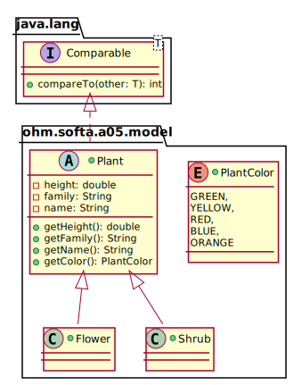
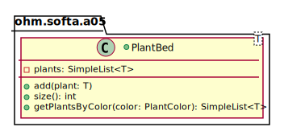

# Assignment 5: Generic bounds

In this assignment we want to deal with generic bounds.
Generic bounds are a great possibility to describe constraints of generic classes or methods.

## Setup

1. Create a fork of this repository (button in the right upper corner)
2. Clone the project (get the link by clicking the green _Clone or download button_)
3. Import the project to your IDE (remember the guide in assignment 1)
4. Validate your environment by running the tests from your IntelliJ and by running `gradle test` on the command line.

## Part 1

First we want to create the model for this assigment:

1. Create the `enum` _PlantColor_
2. Implement the `abstract` class _Plant_
3. Implement the child classes _Flower_ and _Shrub_ 
    _Remarks:_ A shrub is always green. A flower mustn't be green but any other color is possible (handle a wrong value in the constructor)
4. Create tests to ensure that your model classes are correct (e.g. green flowers aren't possible)

## Part 2

Now that we've a model we want to implement a _PlantBed_ which takes care of the plants.

Implement the class _PlantBed_ as given in the UML. The _PlantBed_ may contain any subclass of _Plant_ but nothing else! (Think of the concept of bounds when you declare the generic!)

_Remarks:_ The method `getPlantsByColor` is very easy to implement if you think of the `filter` method of the `SimpleList`! Remember to create tests for nearly every line you code!

## Part 3

Last but not least we'll look at the PECS (**P**roducer **E**extends **C**onsumer **S**uper) principle.

1. Modify the _map_ method in the _SimpleList_ interface according to the PECS principle
2. Implement the utility method _splitBedByColor_ in a utility class _PlantBedUtility_  _Side note:_ why should the class _PlantBedUtility_ be `abstract` and have a `private` constructor? _Remark:_ the given UML for the utility method does not include any generic bound but you **need** some (PECS!) because the compilere won't let you implement the method as described in the UML! 